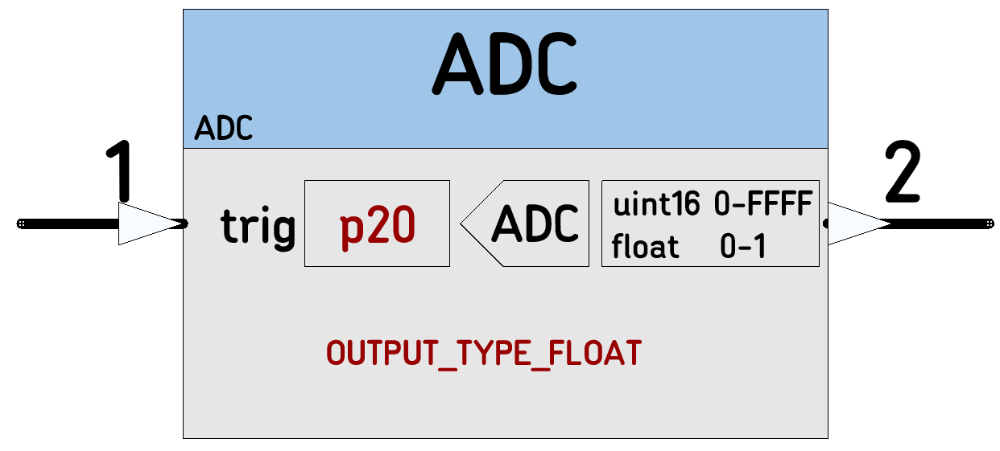

# [ADC](https://github.com/nBlocksStudioNodes/nblocks_adc)

Input triggers a read regardless of value.  
Output is uint32_t (but value = 0 to 0xFFF), or float ( normalized value = 0 to 1)
 
----

----

 *  Category: Input
 *  HAL: mbed
 *  Tested: LPC1768
 *  Author : Fernando Cosentino

## Inputs
 *  (1) Trigger

## Outputs
  *  (2) uint32_t(max 0xFFFF) or float: Measured value

## Parameters
 *  PinName: pinADC
 *  nBlocks_OutputType: data_type
      *  OUTPUT_TYPE_FLOAT
      *  OUTPUT_TYPE_INT

## Example:
[Ticker]-->[ADC]-->[StringFormat]-->[StringSerial] 
